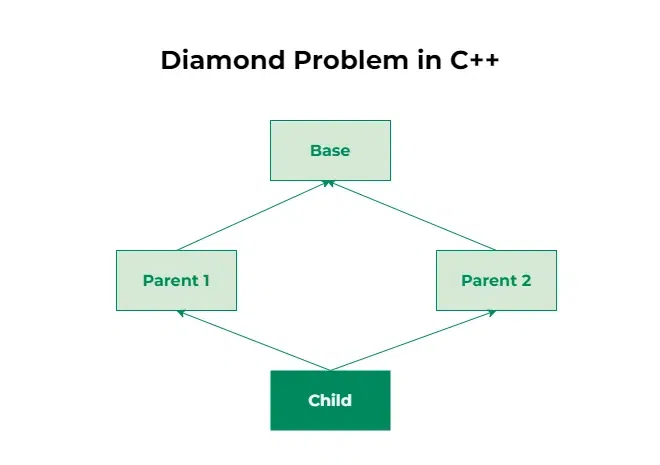

# Полиморфизъм

## Какво е полиморфизъм?

- Позволява обекти от различни класове да бъдат третирани като обекти от един базов клас.
- Основна концепция в **ООП**.


- Вече сме виждали нещо подобно на полиморфизъм

## Как постигаме нещо такова?


---

## Диамантен проблем

Диамантеният проблем се появява при множествено наследяване, когато:

- Един клас наследява два класа
- А те двете наследяват един и същи базов клас.



```cpp
class A {
    public:
    int value;
};

class B : public A {};
class C : public A {};
class D : public B, public C {};

int main() {
    D d;
    d.value = 10;     // ❌ Грешка
    d.B::value = 10;  // ОК
    d.C::value = 20;  // ОК
}

```
### Решение
### Виртуално наследяване

```cpp
class A {
public:
    int value;
};

class B : virtual public A {};
class C : virtual public A {};
class D : public B, public C {};

int main() {
    D d;
    d.value = 10;   // ✔️
    cout << d.value << endl;
}
```

---

## Виртуални методи
### Защо са нужни?

```cpp
#include <iostream>
using namespace std;

class A {
public:
    void foo() {
        cout << "A::foo" << endl;
    }
};

class B : public A {
public:
    void foo() {
        cout << "B::foo" << endl;
    }
};

int main() {
    A* a = new B;
    a->foo(); // ще извика A::foo, не B::foo

    B b;
    b.foo();  // ще извика B::foo

    delete a;
    return 0;
}
```

### Какво са те?
Когато функция е обявена като **virtual**:
> Тази функция може да бъде пренаписана от наследници, и коя точно версия ще се извика ще се решава в РЕАЛНО време (на изпълнение)

```cpp
class A {
public:
    void foo() {
        cout << "A::foo" << endl;
    }
};

class B : public A {
public:
    void foo() {
        cout << "B::foo" << endl;
    }
};
```

---

### Проблем при презаписване
```cpp
class A {
public:
    virtual void foo() const { }
};

class B : public A {
public:
    void foo() { } // Липсва const -> методът се различава от базовия -> не го презаписва, а е напълно различен метод
};
```

## override (C++11)
override в C++ указва, че дадена функция в производен клас задължително трябва да препокрие виртуална функция от базовия клас; ако не съвпада правилно (например по име или типове параметри), компилаторът ще даде грешка.


### По-безопасен подход
```cpp
#include <iostream>
using namespace std;

class A {
public:
    virtual void foo() {
        cout << "A::foo" << endl;
    }
};

class B : public A {
public:
    void foo() override { // ако методът не е намерен в базов клас ще хвърли грешка
        cout << "B::foo" << endl;
    }
};

int main() {
    A* a = new B;
    a->foo();

    B b;
    b.foo();

    delete a;
    return 0;
}
```

---

### Как работи virtual при методи?
## Виртуални таблици

> Виртуалната таблица (vtable) е скрита структура в C++, която се използва, за да се реализира полиморфизъм чрез виртуални функции. Всеки клас с виртуални методи има една vtable, която съдържа указатели към реалните имплементации на тези методи.

> Когато извикаме виртуален метод през указател или референция към базов клас, програмата използва vtable, за да определи в реално време (runtime) коя версия на метода да извика — според истинския тип на обекта.


---


> **Важна забележка:**
> - Полиморфизмът работи с указатели (*) и референции (&).
> - Не работи при локални копия по стойност.

---


## Задача 
Да се реализира клас `Point`, който има за член-данни - `x` и `y` координати на точката.
Да се напишат: 
- подходящи конструктори;
- `Get/SetX/Y` - функции за достъп за член-данните (селектори и мутатори);
- `Print` - метод за отпечатване по подаден поток;
- `DistanceTo` - метод за намиране на разстоянието до точка подадена като параметър.

```cpp
class Point {
public:
    Point();
    Point(double x, double y);

    double GetX() const;
    double GetY() const;

    void SetX(double x);
    void SetY(double y);

    void Print(std::ostream& os = std::cout) const;

    double DistanceTo(const Point& other) const;

private:
    double x; 
    double y; 
};

Point::Point() {
    // TODO: Implement default constructor
}

Point::Point(double x, double y) {
    // TODO: Implement constructor with parameters
}

double Point::GetX() const {
    // TODO: Implement GetX method
}

double Point::GetY() const {
    // TODO: Implement GetY method
}

void Point::SetX(double x) {
    // TODO: Implement SetX method
}

void Point::SetY(double y) {
    // TODO: Implement SetY method
}

void Point::Print(std::ostream& os) const {
    // TODO: Implement Print method
}

double Point::DistanceTo(const Point& other) const {
    // TODO: Implement DistanceTo method
}
```


Да се направи клас `Figure`, който има три виртуални метода - `Print`, `GetArea` и `GetPerimeter`.

Да се реализира клас `Triangle`, който има член-данни 3 точки.
Да се напишат:
- конструктор с параметри;
- `GetPerimeter` - метод за намиране на периметъра на триъгълника;
- `GetArea` - метод за намиране на лице по Херонова формула;
- `Print` - метод за подходящо извеждане на данните на триъгълника по подаден поток.

Да се реализира клас `Quadrilateral`, който описва четириъгълник с член-данни 4 точки.
Да се напишат: 
- подходящи конструктори;
- `GetArea`, `GetPerimeter` - методи за намиране на периметър и лице;
- `Print` - метод за подходящо извеждане на данните на четириъгълника по подаден поток. 

Да се реализира клас `Circle`, който описва окръжност с член-данни точка описваща центъра и радиус.
Да се напишат: 
- подходящи конструктори;
- `GetArea`, `GetPerimeter` - методи за намиране на периметър и лице;
- `Print` - метод за подходящо извеждане на данните на окръжността по подаден поток. 

> Упътване: Лицето на произволен изпъкнал четириъгълник може да намерите като използвате помощния клас за триъгълник, разделяйки го на два триъгълника спрямо единия диагонал и събирайки тези две лица.

Да се реализира клас `Trapezoid`, описващ трапец и клас `Parallelogram`, описващ успоредник. Те са наследници на клас `Quadrilateral`. 
Да се реализира клас `Rhombus`, описващ ромб, клас `Rectangle`, описващ правоъгълник и клас `Square`, описващ квадрат. Те са наследници на клас `Parallelogram`. 

За всички тях да се напишат: 
- подходящи конструктори;
- където е необходимо, собствени реализации на методите `Print`, `GetArea`, `GetPerimeter`.
### Схема на йерархията:


> **Забелешки:**
> - Помислете къде може да не имплементирате дадени методи
> - Помислете какви проблеми може да възникнат при създаването на йерархията
