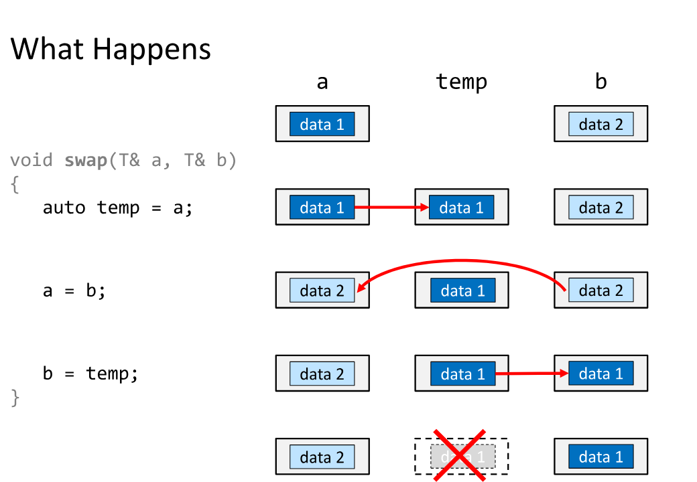
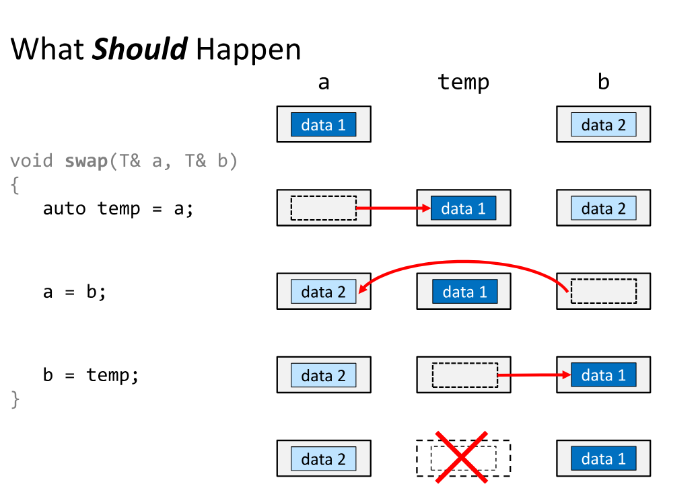

# Move семантика в C++

Move семантиката е въведена в C++11 с цел да се оптимизира управлението на ресурси чрез прехвърляне на собственост вместо копиране. Това е особено полезно при работа с обекти, които притежават динамично заделена памет или други ресурси (например файлови дескриптори, сокети и т.н.).

## 1. Lvalue и Rvalue

- **Lvalue** е стойност, която има име и може да бъде използвана като ляв операнд на присвояване.
- **Rvalue** е временно стойностно изразяване, което няма име. То **може** да бъде "преместено", но **не** и "променяно".

## 2. Move конструктор и move оператор за присвояване

Когато искаме да позволим на обект да **премести** ресурсите от друг обект, дефинираме:

```cpp
class MyClass {
private:
    int* data;

public:
    // Move конструктор
    MyClass(MyClass&& other) noexcept {
        data = other.data;
        other.data = nullptr;
    }

    // Move оператор за присвояване
    MyClass& operator=(MyClass&& other) noexcept {
        if (this != &other) {
            delete data;
            data = other.data;
            other.data = nullptr;
        }
        return *this;
    }

    // Деструктор
    ~MyClass() {
        delete data;
    }
};
```

## 3. std::move

](Graphic.png)

---




Функцията `std::move` **не мести**, а **разрешава преместване** — тя каства Lvalue към Rvalue, за да може move конструкторът да се извика.

Пример:

```cpp
MyClass a;
MyClass b = std::move(a); // Използва се move конструктор
```

## 4. Rule of Five

Когато работим с ресурси, трябва да дефинираме:

1. Деструктор
2. Копиращ конструктор
3. Копиращ оператор
4. Move конструктор
5. Move оператор за присвояване

## 5. Ползи от move семантиката

- Избягване на излишни копия
- По-добра производителност при работа с големи обекти или структури от данни
- Интеграция с `std::vector`, `std::string` и други STL контейнери, които вече поддържат move семантика
